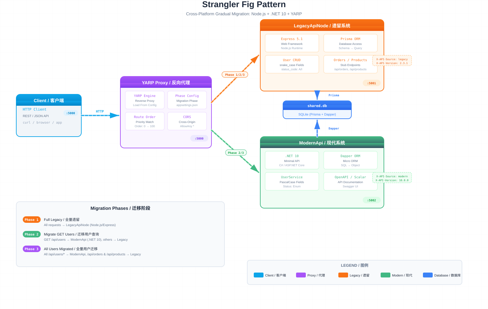

# Strangler Fig Pattern Demo

A cross-platform demo of the **Strangler Fig Pattern** — gradually migrating a legacy Node.js/Express API to a modern .NET 10 API behind a YARP reverse proxy, with zero downtime.

## Architecture



```
Client :5000 → Proxy (YARP) ──┬→ LegacyApiNode :5001  (Node.js + Express + Prisma)
                               └→ ModernApi :5002     (.NET 10 + Dapper)
                                    ↘              ↙
                                   shared.db (SQLite)
```

| Component | Stack | Port | Role |
|-----------|-------|------|------|
| **Proxy** | .NET 10 + YARP | `:5000` | Reverse proxy, config-driven routing, phase management |
| **LegacyApiNode** | Node.js + Express + Prisma | `:5001` | Legacy system with snake_case fields, SQLite persistence |
| **ModernApi** | .NET 10 Minimal APIs + Dapper | `:5002` | Modern system with PascalCase, DI, validation, SQLite persistence |

## How It Works

The proxy uses YARP route configs to decide which backend handles each request. A `CurrentPhase` setting in `appsettings.json` selects the active phase config at startup.

### Migration Phases

| Phase | Config | Routing |
|-------|--------|---------|
| **Phase 1** | `Phase1-FullLegacy` | All requests → LegacyApiNode (Node.js) |
| **Phase 2** | `Phase2-MigrateGetUsers` | `GET /api/users` → ModernApi (.NET), rest → LegacyApiNode |
| **Phase 3** | `Phase3-MigrateAllUsers` | All `/api/users/*` → ModernApi (.NET), rest → LegacyApiNode |

### X-Served-By Header

Each backend returns an `X-Served-By` response header, so you can identify which system served the request:

```
X-Served-By: Node.js/Express (LegacyApi)
X-Served-By: C#/.NET 10 (ModernApi)
```

Additional response headers: `X-API-Source` (legacy/modern), `X-API-Version`, `X-Proxy-Phase`, `X-RequestId`, `X-Response-Time`.

## Quick Start

### Prerequisites

- [.NET 10 SDK](https://dotnet.microsoft.com/download/dotnet/10.0)
- [Node.js](https://nodejs.org/) 18+

### Run the Demo

**Terminal 1** — Start ModernApi (.NET):

```bash
dotnet run --project ModernApi
```

**Terminal 2** — Run the test script (auto-starts LegacyApiNode + Proxy):

```powershell
.\test-migration.ps1
```

The script will:
1. Start the Node.js LegacyApiNode on port 5001
2. Build the Proxy project
3. Run through all three phases, restarting the proxy between each
4. Display results with `X-Served-By` identification
5. Clean up all started processes

### Run Services Individually

```bash
# LegacyApiNode (Node.js)
cd LegacyApiNode && npm run db:setup   # First time: generate Prisma client + create shared.db + seed data
npm start

# ModernApi (.NET)
dotnet run --project ModernApi          # Connects to shared.db, auto-creates table if needed

# Proxy (.NET)
dotnet run --project Proxy
```

## Project Structure

```
├── Proxy/                    # YARP reverse proxy (.NET 10)
│   ├── Program.cs            # Proxy pipeline, middleware, CORS
│   ├── appsettings.json      # CurrentPhase selector
│   ├── appsettings.Phase1-FullLegacy.json
│   ├── appsettings.Phase2-MigrateGetUsers.json
│   └── appsettings.Phase3-MigrateAllUsers.json
├── LegacyApiNode/            # Legacy system (Node.js + Express, ESM)
│   ├── prisma/
│   │   ├── schema.prisma     # Prisma schema (SQLite)
│   │   └── seed.js           # Seed data (7 users)
│   ├── src/
│   │   ├── index.js          # Express app, all endpoints
│   │   └── data.js           # Prisma client with better-sqlite3 adapter
│   ├── prisma.config.ts      # Prisma 7 datasource config
│   └── package.json
├── ModernApi/                # Modern system (.NET 10)
│   ├── Program.cs            # Minimal APIs with DI + DB initialization
│   ├── Models/User.cs        # User model, DTOs, enums
│   └── Services/UserService.cs  # Dapper + SQLite CRUD
├── test-migration.ps1        # Automated test script
├── strangler-fig-architecture.svg
└── CLAUDE.md
```

## Persistence

Both APIs share a single **SQLite** database (`shared.db`) at the project root:

| API | ORM | Database File | Schema |
|-----|-----|---------------|--------|
| LegacyApiNode | Prisma 7 | `shared.db` | `prisma/schema.prisma` (snake_case) |
| ModernApi | Dapper | `shared.db` | Reads/writes via SQL aliases |

- **Shared schema**: `User` table with `user_id`, `user_name`, `user_email`, `created_date`, `status_code` (snake_case)
- **LegacyApiNode**: Prisma 7 with `better-sqlite3` driver adapter, config via `prisma.config.ts`
- **ModernApi**: Auto-creates table if not exists, maps snake_case columns to PascalCase in responses
- Both APIs read/write the same data, demonstrating true gradual migration

## API Endpoints

| Method | Endpoint | LegacyApiNode | ModernApi |
|--------|----------|---------------|-----------|
| GET | `/health` | Phase 1 | Phase 1-3 |
| GET | `/api/users` | Phase 1 | Phase 2-3 |
| GET | `/api/users/{id}` | Phase 1-2 | Phase 3 |
| POST | `/api/users` | - | Phase 3 |
| POST | `/api/users/create` | Phase 1-2 | - |
| PUT | `/api/users/{id}` | Phase 1-2 | Phase 3 |
| DELETE | `/api/users/{id}` | - | Phase 3 |
| GET | `/api/products` | Phase 1-3 | - |
| GET | `/api/orders` | Phase 1-3 | - |

## Data Model

Both APIs share the same `User` table in `shared.db`:

| Column | DB Schema | LegacyApiNode | ModernApi |
|--------|-----------|---------------|-----------|
| `user_id` | INTEGER PK | Direct use | Maps to `Id` |
| `user_name` | TEXT NOT NULL | Direct use | Maps to `Name` |
| `user_email` | TEXT NOT NULL | Direct use | Maps to `Email` |
| `created_date` | TEXT | ISO date string | Parses to `DateTime` |
| `status_code` | TEXT ("A"/"I") | Direct use | Maps to `Active`/`Inactive` |

## License

MIT
