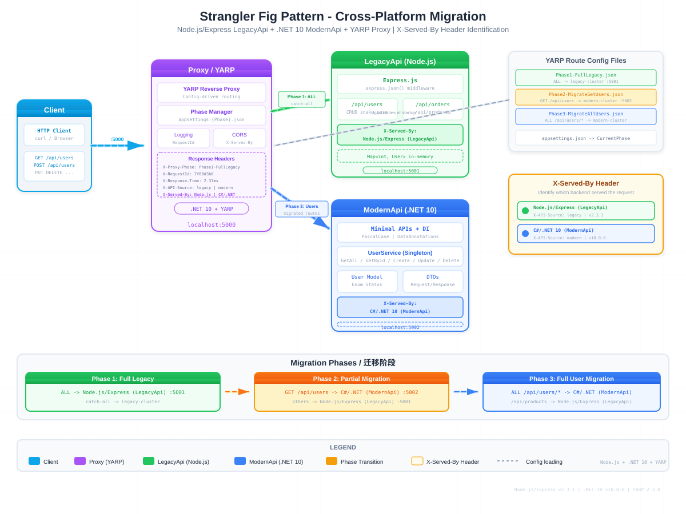

# Strangler Fig Pattern Demo

A cross-platform demo of the **Strangler Fig Pattern** — gradually migrating a legacy Node.js/Express API to a modern .NET 10 API behind a YARP reverse proxy, with zero downtime.

## Architecture



| Component | Stack | Port | Role |
|-----------|-------|------|------|
| **Proxy** | .NET 10 + YARP | `:5000` | Reverse proxy, config-driven routing, phase management |
| **LegacyApi** | Node.js + Express | `:5001` | Legacy system with snake_case fields |
| **ModernApi** | .NET 10 Minimal APIs | `:5002` | Modern system with PascalCase, DI, validation |

## How It Works

The proxy uses YARP route configs to decide which backend handles each request. A `CurrentPhase` setting in `appsettings.json` selects the active phase config at startup.

### Migration Phases

| Phase | Config | Routing |
|-------|--------|---------|
| **Phase 1** | `Phase1-FullLegacy` | All requests -> LegacyApi (Node.js) |
| **Phase 2** | `Phase2-MigrateGetUsers` | `GET /api/users` -> ModernApi (.NET), rest -> LegacyApi |
| **Phase 3** | `Phase3-MigrateAllUsers` | All `/api/users/*` -> ModernApi (.NET), rest -> LegacyApi |

### X-Served-By Header

Each backend returns an `X-Served-By` response header, so you can identify which system served the request:

```
X-Served-By: Node.js/Express (LegacyApi)
X-Served-By: C#/.NET 10 (ModernApi)
```

Additional response headers: `X-API-Source` (legacy/modern), `X-API-Version`, `X-Proxy-Phase`, `X-RequestId`, `X-Response-Time`.

## Quick Start

### Prerequisites

- [.NET 10 SDK](https://dotnet.microsoft.com/download/dotnet/10.0)
- [Node.js](https://nodejs.org/) 18+

### Run the Demo

**Terminal 1** — Start ModernApi (.NET):

```bash
dotnet run --project ModernApi
```

**Terminal 2** — Run the test script (auto-starts LegacyApi + Proxy):

```powershell
.\test-migration.ps1
```

The script will:
1. Start the Node.js LegacyApi on port 5001
2. Build the Proxy project
3. Run through all three phases, restarting the proxy between each
4. Display results with `X-Served-By` identification
5. Clean up all started processes

### Run Services Individually

```bash
# LegacyApi (Node.js)
cd LegacyApiNode && npm start

# ModernApi (.NET)
dotnet run --project ModernApi

# Proxy (.NET)
dotnet run --project Proxy
```

## Project Structure

```
├── Proxy/                    # YARP reverse proxy (.NET 10)
│   ├── Program.cs            # Proxy pipeline, middleware, CORS
│   ├── appsettings.json      # CurrentPhase selector
│   ├── appsettings.Phase1-FullLegacy.json
│   ├── appsettings.Phase2-MigrateGetUsers.json
│   └── appsettings.Phase3-MigrateAllUsers.json
├── LegacyApiNode/            # Legacy system (Node.js + Express)
│   ├── src/
│   │   ├── index.js          # Express app, all endpoints
│   │   └── data.js           # Seed user data (Map)
│   └── package.json
├── ModernApi/                # Modern system (.NET 10)
│   ├── Program.cs            # Minimal APIs with DI
│   ├── Models/User.cs        # User model, DTOs, enums
│   └── Services/UserService.cs
├── test-migration.ps1        # Automated test script
└── StranglerFigDemo-architecture.svg
```

## API Endpoints

| Method | Endpoint | LegacyApi | ModernApi |
|--------|----------|-----------|-----------|
| GET | `/health` | Phase 1 | Phase 1-3 |
| GET | `/api/users` | Phase 1 | Phase 2-3 |
| GET | `/api/users/{id}` | Phase 1-2 | Phase 3 |
| POST | `/api/users` | - | Phase 3 |
| POST | `/api/users/create` | Phase 1-2 | - |
| PUT | `/api/users/{id}` | Phase 1-2 | Phase 3 |
| DELETE | `/api/users/{id}` | - | Phase 3 |
| GET | `/api/products` | Phase 1-3 | - |
| GET | `/api/orders` | Phase 1-3 | - |

## Data Model Comparison

| Field | LegacyApi (Node.js) | ModernApi (.NET) |
|-------|---------------------|-------------------|
| ID | `user_id` (snake_case) | `Id` (PascalCase) |
| Name | `user_name` | `Name` [Required] |
| Email | `user_email` | `Email` [EmailAddress] |
| Date | `created_date` (string) | `CreatedAt` (DateTime) |
| Status | `status_code` ("A"/"I") | `Status` (UserStatus enum) |

## License

MIT
